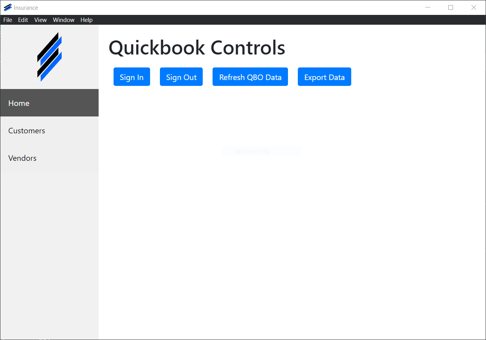
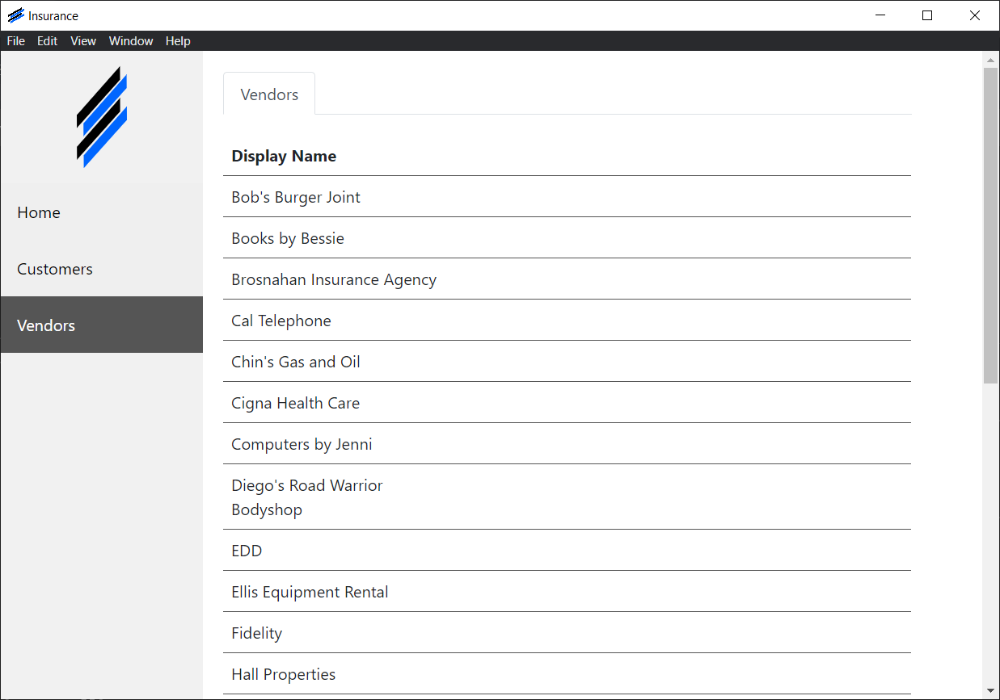
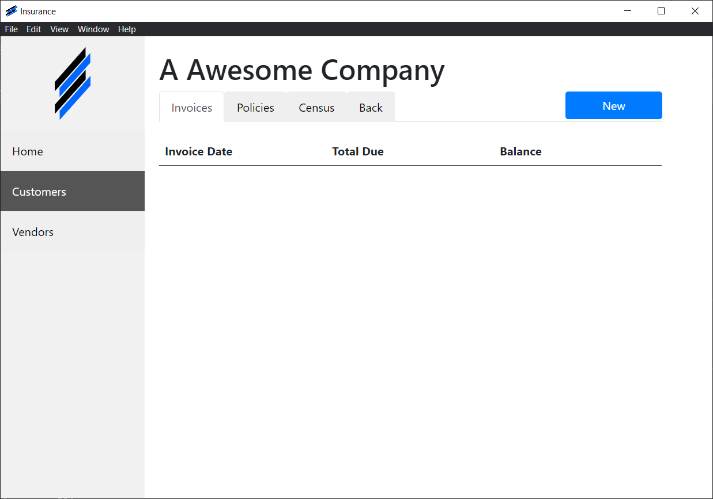
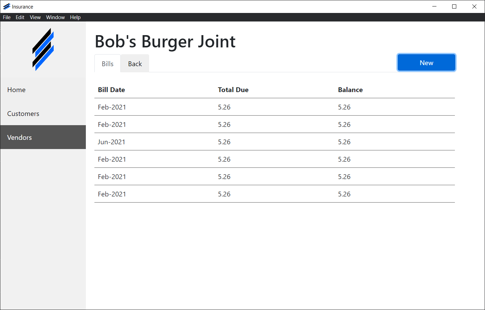
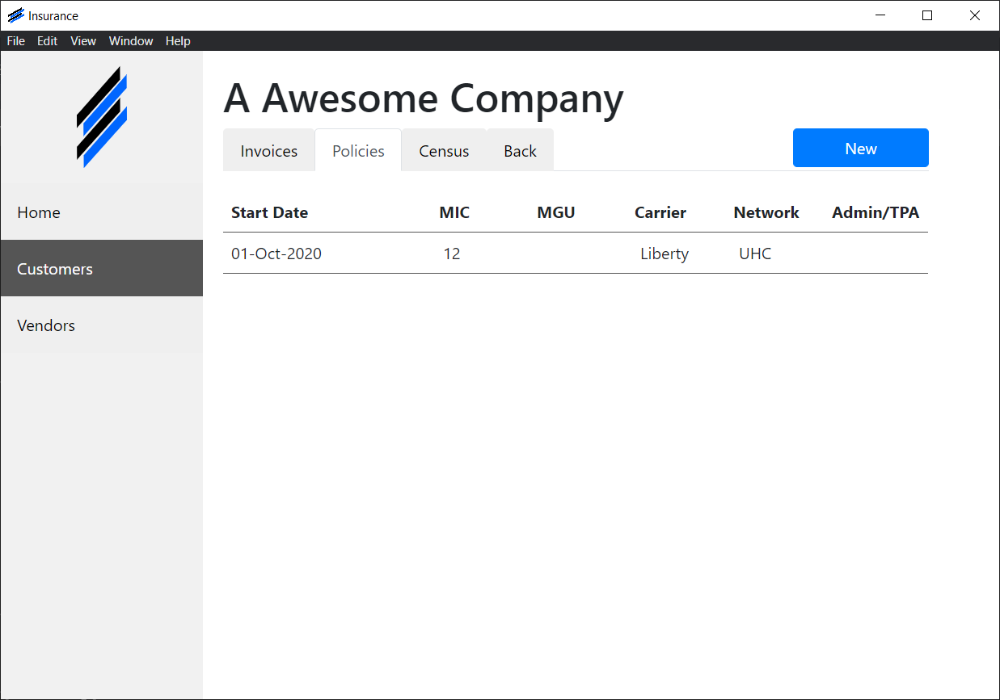
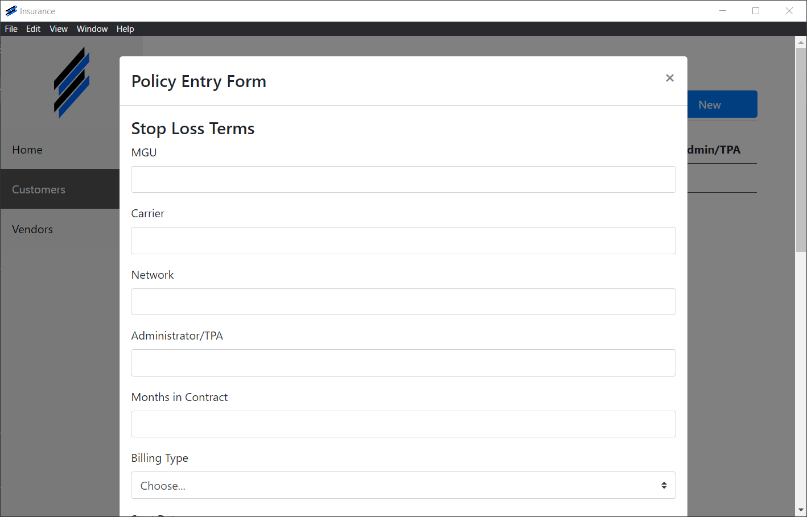
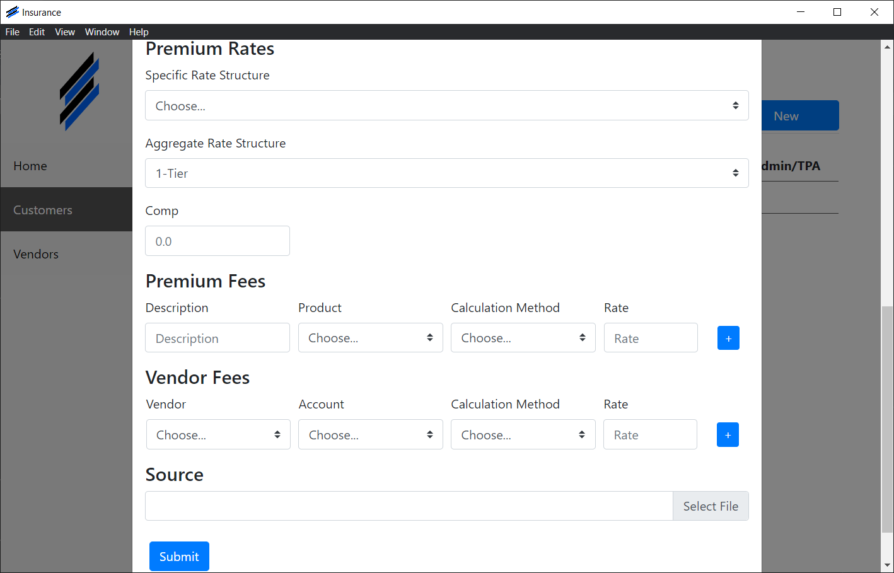
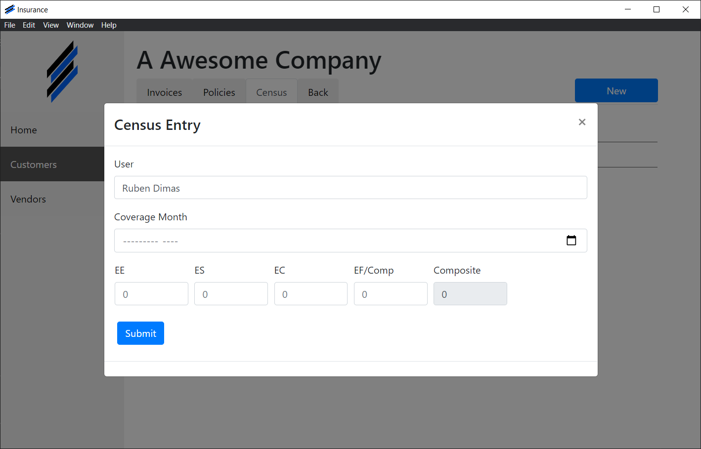
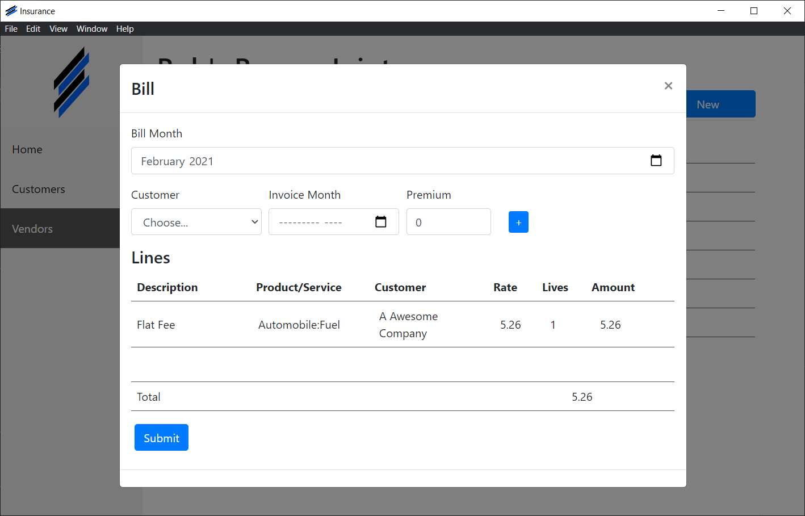

# Insurance

This project was bootstrapped with [Create React App](https://github.com/facebook/create-react-app).

## Setup

### `npm i`

To install all dependecies to be able to run and build app.

### How to run the app

### `npm electron-react-win`

Runs the app in the development mode.\
The page will reload if you make edits.\
You will also see any lint errors in the console.

### How to build the app

Make sure you have the dependencies installed. Next run npm run build and after that run npm run package-win.

